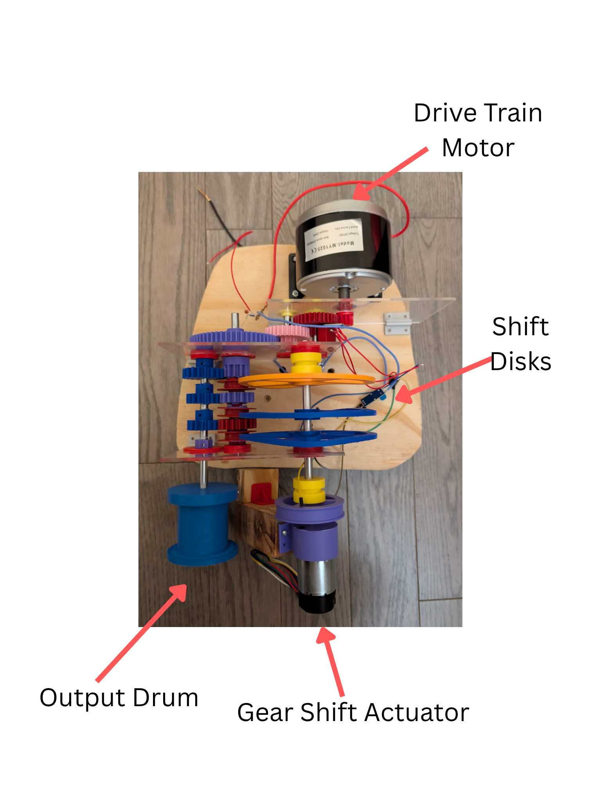
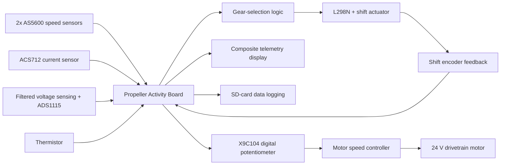
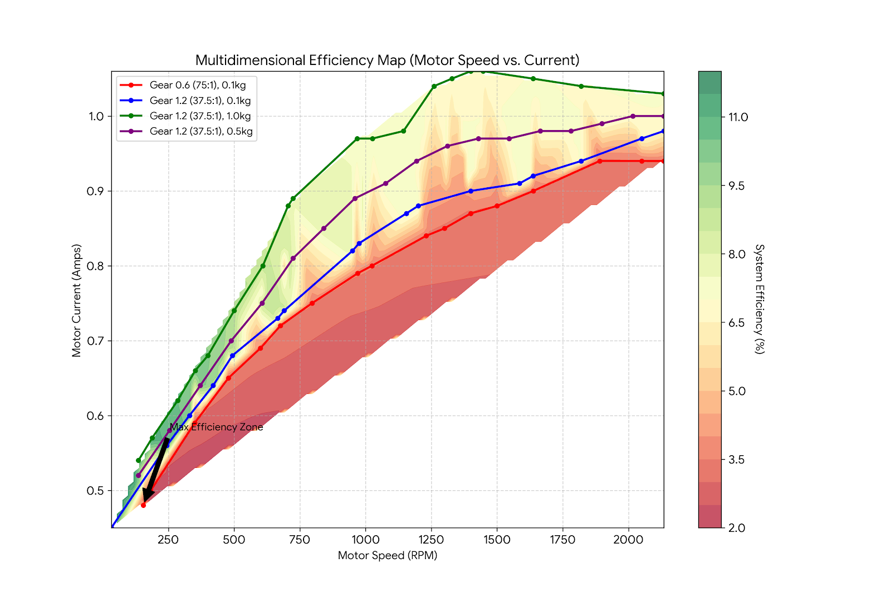
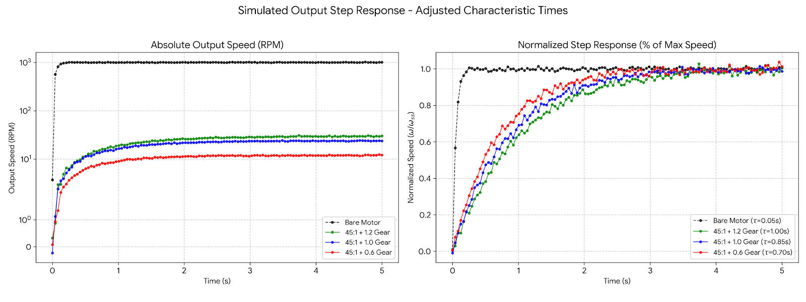

# Embedded ECU-Style Automatic Transmission Controller

An embedded drivetrain test platform that measures motor and output speed, monitors electrical behavior, and commands a three-speed transmission through an encoder-tracked shift actuator. The project combines a custom 3D-printed transmission, concurrent firmware on a Parallax Propeller Activity Board, approximately 33 Hz SD-card telemetry, and Python-based performance analysis.



**Team 8:** Aditya Patil, Dhruv Karnik, and Mudit Adityaja

## What the system does

- Drives a 24 V, 250 W brushed DC motor through a fixed 45:1 primary reduction and selectable 0.6, 1.0, and 1.2 secondary stages.
- Measures motor and output speed with two AS5600 magnetic encoders.
- Measures motor current with an ACS712 and motor voltage through a filtered divider and ADS1115 ADC.
- Applies automatic three-gear shift logic with separate upshift and downshift thresholds.
- Moves the transmission selector using a bidirectional DC motor and encoder tick feedback.
- Sweeps a digital potentiometer to exercise the drivetrain across operating points.
- Displays motor RPM, output RPM, and selected gear as live TV-output telemetry.
- Logs synchronized drivetrain telemetry to an SD card for offline performance and efficiency analysis.

## System architecture



The firmware uses independent Propeller cogs for ADC acquisition, encoder tracking, and potentiometer control while the main loop handles shift decisions and telemetry.

## Mechanical drivetrain

The drivetrain combines a fixed 45:1 primary reduction with three selectable secondary ratios:

| Selected stage | Total reduction | Intended operating behavior |
|---|---:|---|
| 0.6 | 75:1 | Highest mechanical advantage; favors loaded, lower-speed operation |
| 1.0 | 45:1 | Intermediate ratio |
| 1.2 | 37.5:1 | Highest output speed; reflects more load inertia to the motor |

The interchangeable 3D-printed gear stages and pulley-based loading system make the platform useful for studying how ratio selection changes current draw, acceleration, output speed, and efficiency.

## Automatic shifting strategy

The controller starts in first gear and uses calibrated RPM thresholds to select among three ratios:

| Transition | Trigger |
|---|---:|
| Gear 1 to Gear 2 | 600 RPM or greater |
| Gear 2 to Gear 3 | 1,400 RPM or greater |
| Gear 3 to Gear 2 | 1,200 RPM or lower |
| Gear 2 to Gear 1 | 400 RPM or lower |

Separate upshift and downshift thresholds provide hysteresis and reduce gear hunting. Each shift is executed as a calibrated encoder displacement; the checked-in firmware uses 100 ticks for each adjacent gear transition.

## Repository structure

```text
firmware/
  integratedtest2.c       Embedded control, sensing, shifting, and telemetry
  integratedtest2.side    SimpleIDE project configuration
analysis/
  plots.ipynb             Motor performance and efficiency comparisons
  efficiencymap.ipynb     Interpolated multidimensional efficiency maps
media/
  demo.mp4                Hardware demonstration
  drivetrain-hardware.png Annotated physical drivetrain
  *.png                   Experimental and modeled result figures
```

## Hardware and software

### Embedded platform

- Parallax Propeller Activity Board
- 24 V, 250 W brushed DC drivetrain motor
- 3D-printed three-speed transmission and pulley load system
- Two AS5600 magnetic encoders
- ACS712 current sensor
- ADS1115 ADCs with filtered voltage sensing
- Thermistor for motor-temperature telemetry
- L298N motor driver and bidirectional shift actuator
- Encoder feedback
- X9C104 digital potentiometer and DC motor speed controller
- SD-card data logging
- TV text telemetry output
- SimpleIDE / Propeller C

### Analysis

- Python
- Jupyter
- pandas
- NumPy
- Matplotlib
- SciPy

## Experimental results

The report and notebooks compare motor voltage, motor speed, output speed, current, load, transient response, and calculated system efficiency across multiple gear configurations.

### Key findings

- The bare motor drew **21.28 W** at maximum no-load speed; adding the 3D-printed gearbox increased this to **24.37 W**, an approximately **14.5%** increase attributed to drivetrain friction.
- The 75:1 configuration shifted the motor toward higher-speed, lower-current operating regions under the tested loads.
- Lower total reduction increased the load inertia reflected to the motor and lengthened the modeled acceleration response.
- The efficiency-map overlay provided a data-driven basis for comparing operating paths; the archived firmware demonstrates a simpler threshold-and-hysteresis implementation.



The contour map overlays measured operating paths on motor-speed and current coordinates. It highlights how ratio and load move the drivetrain through different efficiency regions.



The modeled normalized responses use characteristic times of approximately 0.70 s for the 75:1 configuration, 0.85 s for 45:1, and 1.00 s for 37.5:1, illustrating the effect of reflected inertia as mechanical advantage decreases.

### Additional notebook outputs


The notebooks reference experimental CSV files named `log3.csv` through `log12.csv`. Those raw logs were not present in the archived project folder, so the repository retains the report figures, notebook outputs, and extracted plots as project evidence rather than presenting the analysis as a reproducible package.

## Engineering considerations and next steps

- Add motion timeouts and limit-switch validation to prevent a stalled shift motor from blocking indefinitely.
- Make shared multi-cog state access explicit and snapshot sensor values before control decisions.
- Calibrate RPM conversion against a tachometer and document sensor pulses per revolution.
- Replace fixed encoder ticks with per-gear calibration and fault detection.
- Restore the raw experiment logs and add a documented efficiency calculation pipeline.
- Separate hardware drivers, transmission control, and display code into testable modules.

## Demo

The complete hardware demonstration is available at [`media/demo.mp4`](media/demo.mp4).
