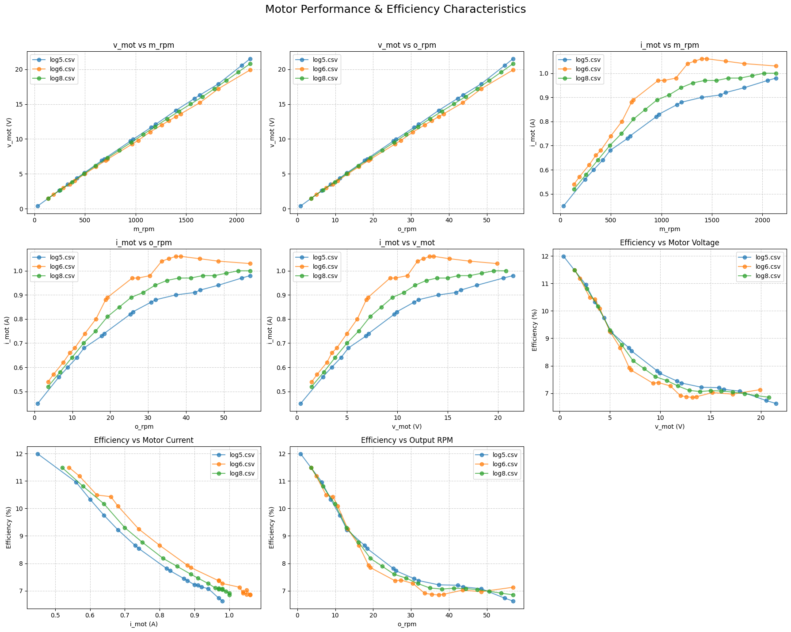
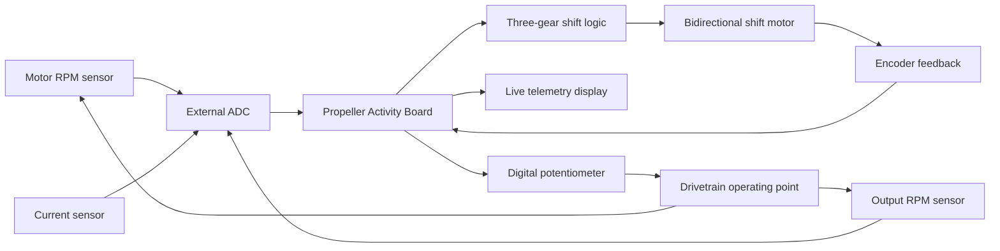
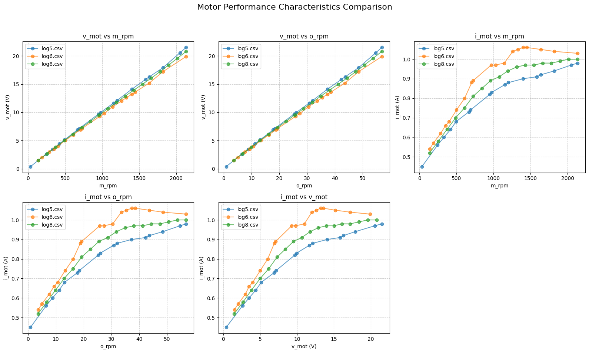
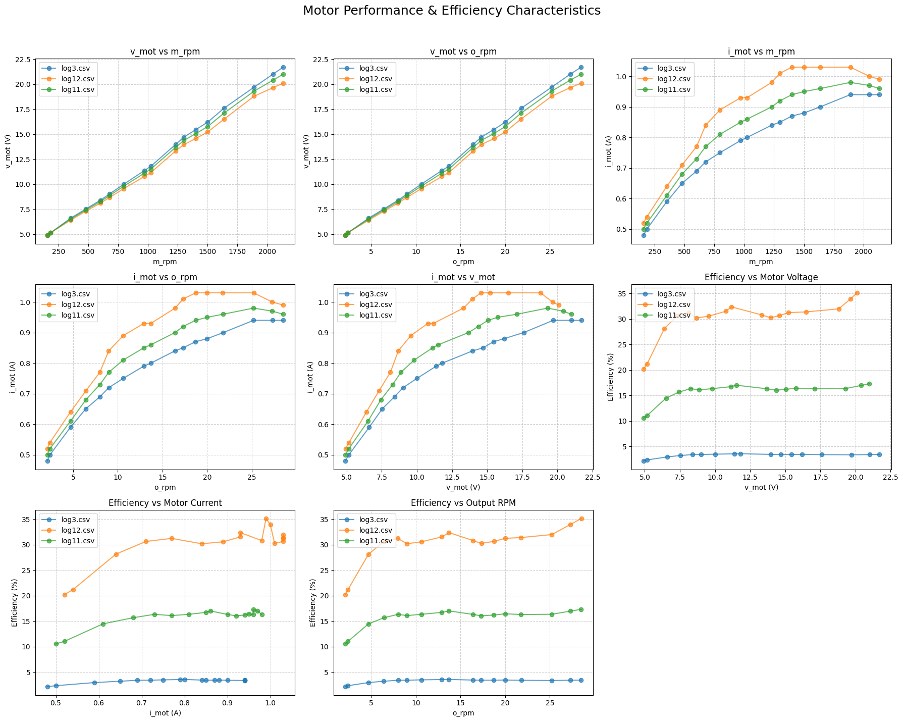

# Embedded ECU-Style Automatic Transmission Controller

An embedded drivetrain test platform that measures motor and output speed, monitors current, and automatically commands a three-speed transmission through an encoder-tracked shift actuator. The project combines concurrent firmware on a Parallax Propeller Activity Board with Python-based motor performance and efficiency analysis.



## What the system does

- Samples two analog RPM signals and a motor-current channel through an external ADC.
- Calculates motor and output RPM from thresholded sensor pulses.
- Applies automatic three-gear shift logic with separate upshift and downshift thresholds.
- Moves the transmission selector using a bidirectional DC motor and encoder tick feedback.
- Sweeps a digital potentiometer to exercise the drivetrain across operating points.
- Displays motor RPM, output RPM, and selected gear as live TV-output telemetry.
- Analyzes logged voltage, current, speed, load, and efficiency data in Jupyter notebooks.

## System architecture



The firmware uses independent Propeller cogs for ADC acquisition, encoder tracking, and potentiometer control while the main loop handles shift decisions and telemetry.

## Automatic shifting strategy

The controller starts in first gear and uses calibrated RPM thresholds to select among three ratios:

| Transition | Trigger |
|---|---:|
| Gear 1 to Gear 2 | 600 RPM or greater |
| Gear 2 to Gear 3 | 1,400 RPM or greater |
| Gear 3 to Gear 2 | 1,200 RPM or lower |
| Gear 2 to Gear 1 | 400 RPM or lower |

Separate upshift and downshift thresholds provide hysteresis and reduce gear hunting. Each shift is executed as a calibrated encoder displacement; the checked-in firmware uses 100 ticks for each adjacent gear transition.

## Repository structure

```text
firmware/
  integratedtest2.c       Embedded control, sensing, shifting, and telemetry
  integratedtest2.side    SimpleIDE project configuration
analysis/
  plots.ipynb             Motor performance and efficiency comparisons
  efficiencymap.ipynb     Interpolated multidimensional efficiency maps
media/
  demo.mp4                Hardware demonstration
  *.png                   Figures recovered from notebook outputs
requirements.txt          Python analysis dependencies
```

## Hardware and software

### Embedded platform

- Parallax Propeller Activity Board
- External SPI ADC
- Two analog RPM sensing channels
- Motor-current sensing channel
- Bidirectional DC shift motor
- Encoder feedback
- Digitally controlled potentiometer
- TV text telemetry output
- SimpleIDE / Propeller C

### Analysis

- Python
- Jupyter
- pandas
- NumPy
- Matplotlib
- SciPy

## Analysis outputs

The notebooks compare motor voltage, motor speed, output speed, current, and calculated system efficiency across multiple load and gear-ratio runs.





## Running the firmware

1. Open `firmware/integratedtest2.side` in SimpleIDE.
2. Confirm the board target is `ACTIVITYBOARD`.
3. Install or provide the project-specific `adcDCpropab` ADC library and Parallax `simpletools`/`TvText` libraries.
4. Verify every pin assignment and mechanical shift limit before energizing the drivetrain.
5. Build and load the firmware to the Propeller board.

> The shift routine is calibration-dependent and does not include end-stop timeout protection. Test with the drivetrain unloaded and be prepared to remove power during initial calibration.

## Running the analysis

```bash
python -m venv .venv
.venv\Scripts\activate
pip install -r requirements.txt
jupyter lab analysis
```

The notebooks reference experimental CSV files named `log3.csv` through `log12.csv`. Those raw logs were not present in the archived project folder and are therefore not included here. Existing notebook outputs and extracted figures are retained as project evidence, but regenerating the plots requires restoring CSV files with columns such as `v_mot`, `i_mot`, `m_rpm`, `o_rpm`, `eff`, `gear`, `mass`, and `l_tau`.

## Engineering considerations and next steps

- Add motion timeouts and limit-switch validation to prevent a stalled shift motor from blocking indefinitely.
- Make shared multi-cog state access explicit and snapshot sensor values before control decisions.
- Calibrate RPM conversion against a tachometer and document sensor pulses per revolution.
- Replace fixed encoder ticks with per-gear calibration and fault detection.
- Restore the raw experiment logs and add a documented efficiency calculation pipeline.
- Separate hardware drivers, transmission control, and display code into testable modules.

## Demo

The complete hardware demonstration is available at [`media/demo.mp4`](media/demo.mp4).
